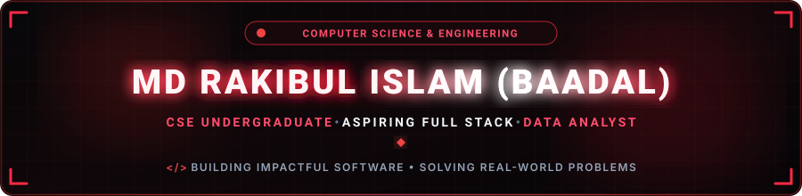

  

  

  
  &nbsp;
  
  &nbsp;
  
  &nbsp;
  
  &nbsp;
  
  &nbsp;
  
  &nbsp;
  

 

<!-- =================================================== -->
<!--                      ABOUT ME                       -->
<!-- =================================================== -->

## 🧑‍💻 About Me

I am a passionate **Computer Science & Engineering student** at **Daffodil International University (DIU)**, dedicated to building scalable web applications and mastering algorithmic problem solving. I bridge low-level algorithmic foundations in **C++** with modern full-stack development in **React, Next.js, and Node.js**.

- 🎓 **Academics:** B.Sc. in Computer Science & Engineering at Daffodil International University (4th Semester)
- 🚀 **Focus:** Aspiring Full Stack Developer & AI/ML Engineer
- 📚 **Continuous Learning:** Data Structures, Algorithms (DSA) & Modern Web Development
- 📅 **GitHub Member:** Building and contributing since **November 17, 2022**
- 💻 **Core Specialties:** Full Stack Web Development, C++20, Data Structures & Algorithms, Systems Architecture
- 🎯 **Career Objective:** Seeking **Software Engineering & Web Development Internships** to build impactful, production-grade systems
- 🏛️ **Affiliation & Labs:** Member of [@Gynonada](https://github.com/Gynonada)
- 🏅 **Recognition:** GitHub **Developer Program Member** & GitHub **PRO** Student Developer
- 💬 **Ask Me About:** C++, JavaScript / TypeScript, React, Next.js, Algorithm Optimization & Clean Code

 

<!-- =================================================== -->
<!--             ACHIEVEMENTS & HIGHLIGHTS               -->
<!-- =================================================== -->

## 🏆 Official GitHub Achievements & Badges

  
  &nbsp;&nbsp;
  
  &nbsp;&nbsp;
  
  &nbsp;&nbsp;
  
  &nbsp;&nbsp;
  
  &nbsp;&nbsp;
  

  

 

<!-- =================================================== -->
<!--                 FEATURED PROJECTS                   -->
<!-- =================================================== -->

## 🚀 Featured Projects

<table width="100%" border="0" align="center">
  <tr>
    <td width="50%" valign="top" style="padding: 16px; background: rgba(220, 38, 38, 0.04); border: 1px solid rgba(239, 68, 68, 0.3); border-radius: 12px;">
      <h3 style="margin-top: 0;">⚔️ CP Mastery Hub</h3>
      
<i>An All-in-One Competitive Programming &amp; DSA suite featuring a 20-chapter roadmap, 60fps algorithm visualizer, in-browser code runner, live contest radar, and 1-click GitHub push.</i>

      

        
        
        
      

      

        
        &nbsp;
        
      

    </td>
    <td width="50%" valign="top" style="padding: 16px; background: rgba(220, 38, 38, 0.04); border: 1px solid rgba(239, 68, 68, 0.3); border-radius: 12px;">
      <h3 style="margin-top: 0;">🎯 Discipline Tracker (DevTrack PRO)</h3>
      
<i>A habit defense and productivity platform built with Clean Architecture, featuring an OS-level Picture-in-Picture floating timer, interactive GitHub-style heatmap, and AI coach.</i>

      

        
        
        
      

      

        
        &nbsp;
        
      

    </td>
  </tr>
  <tr>
    <td width="50%" valign="top" style="padding: 16px; background: rgba(220, 38, 38, 0.04); border: 1px solid rgba(239, 68, 68, 0.3); border-radius: 12px;">
      <h3 style="margin-top: 0;">📈 NEXUS Future Simulator</h3>
      
<i>Mathematical life simulation engine modeling 5-to-10-year skill mastery, career trajectory, and stochastic compounding outcomes based on daily deliberate effort variance.</i>

      

        
        
        
      

      

        
        &nbsp;
        
      

    </td>
    <td width="50%" valign="top" style="padding: 16px; background: rgba(220, 38, 38, 0.04); border: 1px solid rgba(239, 68, 68, 0.3); border-radius: 12px;">
      <h3 style="margin-top: 0;">🗺️ DIU Campus Navigator</h3>
      
<i>An interactive campus routing engine using Dijkstra's algorithm and Three.js 3D rendering to compute optimal navigation routes between university buildings and facilities.</i>

      

        
        
        
      

      

        
        &nbsp;
        
      

    </td>
  </tr>
</table>

  

 

<!-- =================================================== -->
<!--                 TECH STACK & TOOLS                  -->
<!-- =================================================== -->

## 🛠️ Tech Stack & Skills

<table width="100%" border="0">
  <tr>
    <td width="30%"><b>Languages</b></td>
    <td>
      
    </td>
  </tr>
  <tr>
    <td width="30%"><b>Frontend & UI</b></td>
    <td>
      
    </td>
  </tr>
  <tr>
    <td width="30%"><b>Backend & Databases</b></td>
    <td>
      
    </td>
  </tr>
  <tr>
    <td width="30%"><b>Developer Tools & OS</b></td>
    <td>
      
    </td>
  </tr>
</table>

 

<!-- =================================================== -->
<!--            PROBLEM SOLVING & LEETCODE               -->
<!-- =================================================== -->

## 🧩 Problem Solving & Competitive Programming

  

  
  &nbsp;&nbsp;
  
  &nbsp;&nbsp;
  
  &nbsp;&nbsp;
  

 

<!-- =================================================== -->
<!--              GITHUB ANALYTICS & ACTIVITY            -->
<!-- =================================================== -->

## 📊 GitHub Analytics

  
  &nbsp;&nbsp;
  

  

  

  

  

 

<!-- =================================================== -->
<!--                DAILY INSPIRATION                    -->
<!-- =================================================== -->

  

 

<!-- =================================================== -->
<!--              CONNECT & COLLABORATE                  -->
<!-- =================================================== -->

## 📬 Let's Connect

  <i>Open for collaborations on software projects, developer tools, and internship opportunities.</i>

  
  &nbsp;
  
  &nbsp;
  
  &nbsp;
  
  &nbsp;
  
  &nbsp;
  

  

